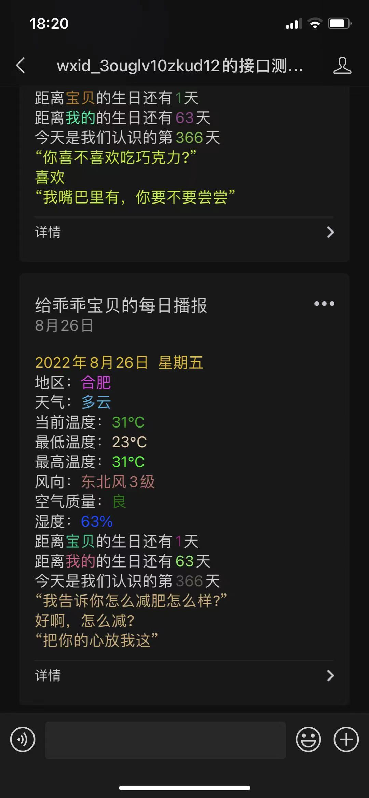
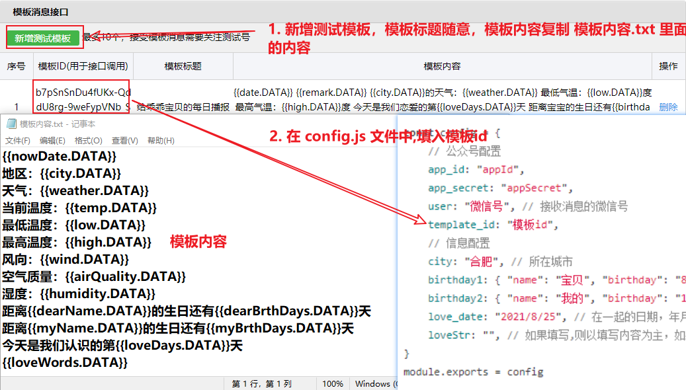
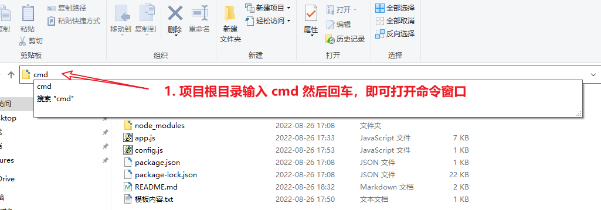

# 微信公众号每日天气推送

## 项目介绍
nodejs 项目（公众号推送早安问候以及天气预报）  

## 演示图例
 

## 准备工作
1. 微信公众平台接口测试账号申请：https://mp.weixin.qq.com/debug/cgi-bin/sandbox?t=sandbox/login   
2. 在 config.js 文件中，填写微信公众号信息
- (1). 微信扫一扫登录
  
- (2). 在 config.js 文件中，填写 appID 和 appsecret
  
- (3). 在 config.js 文件中，填写微信号
  
- (4). 在 config.js 文件中，填写模板id
  

## 模板内容如下
```text
{{nowDate.DATA}}
地区：{{city.DATA}}
天气：{{weather.DATA}}
当前温度：{{temp.DATA}}
最低温度：{{low.DATA}}
最高温度：{{high.DATA}}
风向：{{wind.DATA}}
空气质量：{{airQuality.DATA}}
湿度：{{humidity.DATA}}
距离{{dearName.DATA}}的生日还有{{dearBrthDays.DATA}}天
距离{{myName.DATA}}的生日还有{{myBrthDays.DATA}}天
今天是我们认识的第{{loveDays.DATA}}天
{{loveWords.DATA}}
```  

## 如何运行
执行 node app.js 命令，启动项目即可实现消息推送

## 小白可能需要看的
1. 电脑需要安装 nodejs，[nodejs 下载地址](https://nodejs.org/zh-cn/download/)
2. 安装 nodejs 时，一直点下一步，不需要做任何选项的勾选。[可参考教程](https://www.runoob.com/nodejs/nodejs-install-setup.html)
3. 安装成功后，在项目根目录，执行 node app.js 命令
  
  